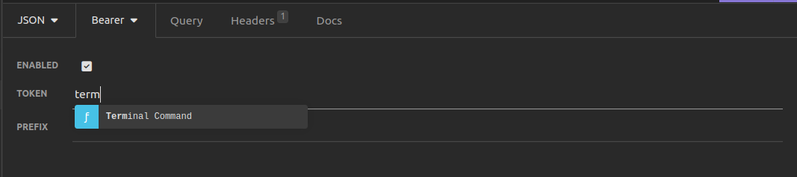
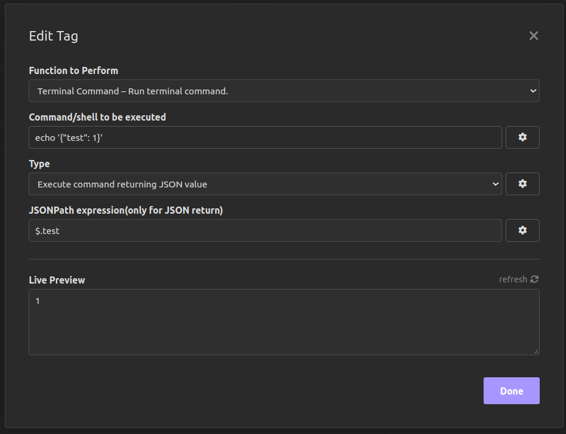

# insomnia-plugin-terminal-command
Use terminal command output in Insomnia.

----

## Add general terminal command
Use Template Tags (i.e., CTRL + SPACE, then find "Terminal Command") to add terminal command.

## Example: run command and filter json

The plugin supports string ouptut and json output and filtering with `jsonpath`.
Important filtering is only used when json return type is selected.

## Limitations

The plugin runs terminal using `child_process`.
Lookup on Unix is performed on a default search path search of `/usr/bin:/bin`, on Windows the current processes environment variable `PATH` is used.
If your command is not found then you need to use the full path to the command to run it. 

## How to contribute

Contributions, issues and feature requests are welcome. Feel free to open an [issue](https://github.com/vimekk/insomnia-plugin-terminal-command/issues) or create a [pull request](https://github.com/vimekk/insomnia-plugin-terminal-command/pulls).